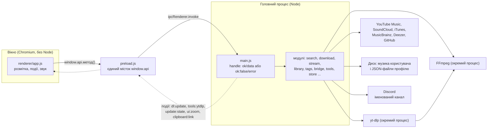
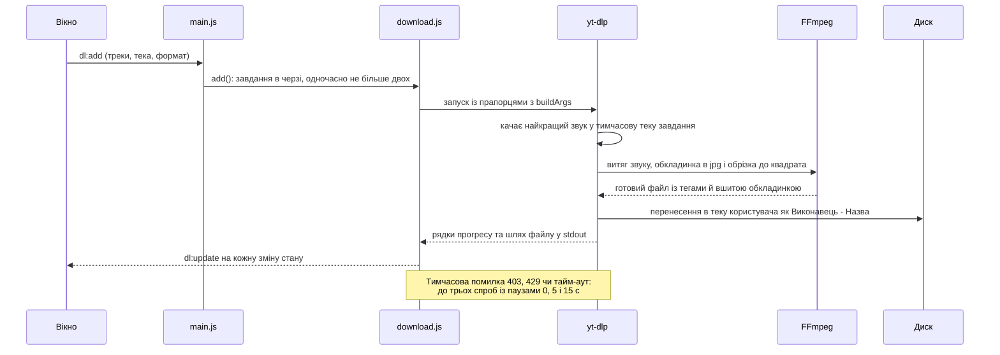
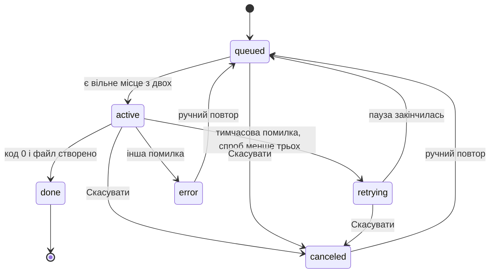

# Як це влаштовано

Записка для того, хто відкриє цей код через півроку — зокрема для мене самого.

Тут навмисно немає переказу того, що вже написано в коді. Кожен модуль
пояснює у своїй шапці, **чому** він такий; дублювати це означало б завести
другу правду, яка розійдеться з першою за місяць. Тут — те, чого не видно
з жодного окремого файлу: хто з ким розмовляє, де лежать дані й що зламається,
якщо порушити кілька негласних правил.

Зміст: [дві половини](#дві-половини) · [модулі](#модулі-головного-процесу) ·
[вікно](#вікно) · [шлях завантаження](#шлях-завантаження) ·
[дані користувача](#де-лежать-дані) · [IPC](#канали-ipc) ·
[правила](#правила-які-дорого-відкривати-заново) · [тести](#тести) ·
[складання і реліз](#складання-і-реліз)

## Дві половини

**Вікно не має доступу ані до Node, ані до файлів.** `contextIsolation: true`,
`nodeIntegration: false`, а політика безпеки в `index.html` забороняє все, крім
власних скриптів і стилів (картинки — лише `https:`/`data:`, звук — `https:`,
`file:`, `blob:`). Усе, що вікно вміє, перелічене в
[`src/preload.js`](app/src/preload.js) — 52 канали виклику й 5 підписок на події,
і жодного способу зробити щось поза цим списком. Тому будь-яка нова можливість,
що торкається диска чи мережі, — це завжди пара «обробник у головному процесі +
рядок у preload», а не виклик з інтерфейсу.

Кожен виклик повертає `{ok, data}` або `{ok: false, error}`, і `preload`
розпаковує це у звичайне значення або виняток. Обгортка `handle()` у
[`main.js`](app/src/main/main.js) робить це для всіх каналів одразу — окремо
ловити помилки в обробниках не треба. Єдиний виняток — `update:install`: він
реєструється окремо, лише у встановленій програмі (`setupUpdates`).

Крім IPC, `main.js` тримає на собі: єдиний екземпляр програми
(`requestSingleInstanceLock`), меню (без нього в Electron мовчить `Ctrl+V`),
масштаб, стеження за буфером обміну (раз на 1.2 с, лише посилання на музику),
автооновлення програми через `electron-updater` (раз на шість годин, лише
встановлена) і підняття вікна після краху.

## Модулі головного процесу

| Модуль | Відповідає за | Не робить |
|---|---|---|
| [`main.js`](app/src/main/main.js) | вікно, меню, усі канали IPC, автооновлення, масштаб, буфер обміну, виживання після краху | жодної логіки — лише склеює |
| [`search.js`](app/src/main/search.js) | пошук по всіх джерелах, рекомендації, сторінки альбомів і виконавців, текст пісні | не качає й не грає |
| [`download.js`](app/src/main/download.js) | черга завантажень поверх yt-dlp, повтори, прогрес | не знає про пошук |
| [`stream.js`](app/src/main/stream.js) | пряме посилання на звук для `<audio>` | не зберігає файлів |
| [`library.js`](app/src/main/library.js) | читання тегів із диска, обкладинки | не веде бази |
| [`tags.js`](app/src/main/tags.js) | правка тегів і перейменування через ffmpeg | не чіпає звук |
| [`bridge.js`](app/src/main/bridge.js) | назви треків зі Spotify та Apple Music | звук звідти не бере — його там нема |
| [`binaries.js`](app/src/main/binaries.js) | пошук yt-dlp та ffmpeg | не оновлює їх |
| [`tools.js`](app/src/main/tools.js) | оновлення yt-dlp | не чіпає ffmpeg |
| [`store.js`](app/src/main/store.js) | атомне читання й запис файлів користувача | не знає, що саме зберігає |
| [`settings.js`](app/src/main/settings.js) | налаштування й типові значення, вшитий ID Discord | — |
| [`personal.js`](app/src/main/personal.js) | улюблене та історія | — |
| [`playlists.js`](app/src/main/playlists.js) | плейлисти | — |
| [`session.js`](app/src/main/session.js) | що грало: черга, місце, секунда | — |
| [`discord.js`](app/src/main/discord.js) | статус у Discord, протокол напряму | — |

Залежності деревні: `search` знає про `binaries` і `bridge`; `download`,
`stream`, `tags` і `tools` — про `binaries`; `personal`, `settings`, `session`
і `playlists` — про `store`, а `playlists` ще й про `personal`; `library` і
`discord` самодостатні. Зворотних зв'язків немає ніде — усе збирає `main.js`.

## Вікно

Один файл, [`renderer/app.js`](app/src/renderer/app.js), близько 3100 рядків,
поділений підписаними розділами (сторінки Головна, Шукач, Черга, Сховище,
Плейлисти, Налаштування; далі пошук, завантаження, теги, плеєр, черга
відтворення, сеанс, події, старт). Це свідомо: збирача в проєкті немає, вікно
вантажиться через `file://`, а справжні модулі там не працюють — Chromium ріже
`import` за CORS. Розбити його можна лише власним протоколом `app://` або
збирачем, і поки що ціна більша за користь.

Усередині варто знати три речі:

- **`state`** — уся пам'ять інтерфейсу одним об'єктом. Черга відтворення живе
  в `state.pq`, і саме вона пересилається в `session.js`.
- **Таблиці дій** — `ACTIONS`, `LIB_ACTIONS`, `JOB_ACTIONS`, `HOME_ACTIONS`,
  `PL_ACTIONS`. Розмітка каже `data-act="listen"`, таблиця каже, що це означає.
  Нова кнопка — це запис у таблиці, а не гілка в ланцюгу `if`.
- **`index`** — карта `джерело:id → об'єкт` для всього, що зараз намальовано.
  Рядки носять у розмітці лише ключ, а не самі дані.

## Шлях завантаження

Що відбувається між натисканням «Завантажити» і файлом у теці. Усю роботу з
тегами й обкладинкою виконує сам yt-dlp, звертаючись до FFmpeg; наш код лише
складає правильні прапорці (`buildArgs`) і читає вивід (`parseLine`).

Стани одного завдання:

Прослуховування без завантаження йде іншим шляхом: `stream.js` просить у
yt-dlp лише пряме посилання (`-g`) і віддає його тегу `<audio>`. Посилання
кешується до свого `expire` мінус хвилина; отримав 403 — вікно перепитує з
`force`.

## Де лежать дані

Усе — в теці профілю (`%APPDATA%\Music Grabber` у встановленої програми,
`%APPDATA%\music-grabber` при запуску з вихідних кодів):

| Файл | Що всередині | Чи можна втратити |
|---|---|---|
| `playlists.json` | плейлисти, разом із незавантаженими треками | **ні** — цього немає більше ніде у світі |
| `personal.json` | улюблене та історія (300 останніх) | прикро, але переживно |
| `settings.json` | налаштування | так, усе має типове значення |
| `session.json` | що грало минулого разу (до 200 треків) | так |
| `crash.log` | причини падінь вікна | так |
| `bin/` | yt-dlp, оновлений після встановлення | так, підтягнеться знову |

Окрім профілю, програма пише ще в два місця: сама музика — туди, куди вказав
користувач (типово `Музика\Завантажено`), а проміжні файли завантажень — у
`%TEMP%\music-grabber\<завдання>`; цю теку стирає і сама програма при старті.

Читає й пише JSON лише `store.js`, і робить це атомно: спершу в `.tmp`, потім
перейменування поверх. Нечитний файл він не ковтає мовчки — відкладає поруч
як `.broken` і повідомляє про це вікну через `app:troubles`.

Сама музика тут не згадана в таблиці навмисно: вона лежить там, куди її поклав
користувач, і **диск є єдиним джерелом правди**. Своєї бази музики програма
не веде — саме тому Сховище щоразу читає теги з файлів (з кешем за розміром і
часом зміни).

## Канали IPC

Виклики з вікна (усі через `preload.js`, усього 52):

| Група | Канали |
|---|---|
| пошук | `search:query` `search:cancel` `search:soundcloud` `search:album` `search:artist` `search:artistByName` `search:resolveCatalog` `search:mbReleases` |
| завантаження | `dl:add` `dl:cancel` `dl:retry` `dl:list` `dl:clear` |
| відтворення | `stream:url` `reco:radio` `reco:home` `reco:mix` `reco:lyrics` |
| сховище | `lib:scan` `lib:cover` `lib:tags` `lib:trash` |
| особисте | `fav:list` `fav:toggle` `hist:list` `hist:add` `hist:clear` |
| плейлисти | `pl:list` `pl:create` `pl:rename` `pl:remove` `pl:add` `pl:removeTrack` |
| Discord | `discord:connect` `discord:disconnect` `discord:status` `discord:activity` |
| система | `binaries:status` `tools:ytdlpCheck` `tools:ytdlpUpdate` `settings:get` `settings:set` `ui:zoom` `session:save` `session:restore` `app:version` `app:troubles` `update:install` `dialog:folder` `shell:reveal` `shell:openFolder` `shell:external` |

Події в бік вікна: `dl:update` (стан завдання), `clipboard:link` (скопійоване
посилання), `tools:ytdlp` (yt-dlp оновлено), `ui:zoom` (масштаб змінили з
клавіатури), `update:state` (стан оновлення програми).

Новий канал — це чотири місця: обробник `handle(...)` у `main.js`, рядок у
`preload.js`, виклик у `app.js` і (якщо канал робить щось видиме) перевірка в
`ui.test.js`.

## Правила, які дорого відкривати заново

**Прапорці yt-dlp не чіпати, не перевіривши результат на диску.** Кожен у
`buildArgs` закриває конкретну поломку: `webp` не вшивається в mp3, `bestaudio`
віддає webm без обкладинки, YouTube пише всіх виконавців через кому. Пояснення
— в шапці `download.js`, перевірка — в `args.test.js`. Не «лагодити» 403
іншим клієнтом YouTube: це ламає вибір формату; 403 минає повтором.

**Пошук мусить бути скасовним.** Кнопка «Стоп» справді вбиває процеси yt-dlp і
рве мережеві запити, а не просто ховає результат. Кожен новий пошук отримує
`searchId`, і все, що для нього запущено, лежить у реєстрі `running`. А
SoundCloud іде окремим викликом (`search:soundcloud`): він набагато повільніший
за решту (близько 4 с проти 0.4 с), бо щоразу піднімає yt-dlp, і спільний запит
чекав би на нього.

**Одне джерело не має права зламати пошук.** `searchAll` збирає відповіді через
`allSettled`, а помилки джерел віддає списком окремо.

**Пізні результати не малюють поверх чужої сторінки.** SoundCloud відповідає
секунди на чотири; за цей час людина встигає піти в Сховище. Результат завжди
кладеться в пам'ять, але малюється лише якщо вона досі в Шукачі.

**Нічого не продовжує грати саме.** Ані після падіння вікна, ані після запуску
програми. Якщо крах спричинив саме той потік, автозапуск відтворив би крах.
Вікно після краху піднімається не більше трьох разів поспіль (`MAX_REVIVALS`),
причини лягають у `crash.log`.

**У головному процесі немає синхронних викликів зовнішніх програм** там, де їх
може дочекатись вікно. `yt-dlp.exe` — це запакований Python, кожен запуск
розпаковує себе кілька секунд, і синхронний виклик морозить усе вікно разом з
IPC. Версія читається через `binaries.ytdlpVersion()` і кешується. Єдине
виправдане місце синхронного виклику — `binaries.status()` на старті, коли
нічого ще не намальовано.

**Файли користувача пишуться лише через `store.js`.** Прямий `writeFileSync`
поверх живого файлу — це шлях до втраченого плейлиста. Зіпсований файл не
«скидається» мовчки: його відкладають як `.broken` і кажуть про це.

**Нове джерело пошуку вмикається один раз.** `settings.knownSources` відрізняє
«користувач вимкнув» від «з'явилось у новій версії». Додав джерело в
`DEFAULTS.sources` — воно саме ввімкнеться в усіх, хто його ще не бачив.

**Discord від'єднується, коли нічого не грає** — інакше в профілі висить гола
назва програми без пісні. На старті до Discord теж не під'єднуємось, а лише з
першим треком. ID додатка вшитий у `settings.js` і не є таємницею.

**Бінарники лежать не лише в `app/bin`.** Свіжий yt-dlp лягає в профіль
користувача й має пріоритет над вшитим (схема порядку — в
[README](README.md#де-програма-бере-ffmpeg-і-yt-dlp)). Заміна йде
перейменуванням на `.old`, бо Windows не дає видалити виконуваний файл; `.old`
і `.part` прибираються при наступному запуску (`tools.sweepOld`). Після
оновлення викликається `binaries.reset()`, інакше кеш віддавав би стару копію.

## Тести

Поділені за однією ознакою — чи потрібна мережа.

| Набір | Що перевіряє |
|---|---|
| `test:fast` (кілька секунд) | `store` — атомний запис і зіпсовані файли; `parse` — розбір Spotify, Apple, тривалостей, імен файлів; `args` — прапорці yt-dlp і розбір його виводу |
| `test:live` (близько 6 хв) | `download` — справжнє завантаження з YouTube; `ui` — наскрізна перевірка вікна через DevTools-протокол (порт 9333) |

Живий набір піднімає справжнє вікно у **власному профілі** (`mg-test-profile`
у `%TEMP%`) — у справжні налаштування він не пише нічого. Це не дрібниця:
колись він вимикав Discord у робочому профілі й лишав там вигаданий ID.

`MG_SHOTS=<тека>` вмикає знімки вікна. Частину поломок — розтягнуту мітку,
мертву смужку, підмінену сторінку — видно тільки оком. `MG_DEBUG=1` виводить
помилки вікна в консоль, звідки запущено програму.

## Складання і реліз

`npm run bins` кладе yt-dlp і ffmpeg у `app/bin` (папка в `.gitignore`: це
чужі бінарники); це ж робиться автоматично перед `build` і `release`, тож
інсталятор без них не виходить. Збірка — NSIS-інсталятор (`app/dist`), не
«в один клік», користувач може змінити теку. `npm run icon` перемальовує
`build-assets/icon.ico` — потрібно лише якщо змінився сам знак у
`ICONS.valknut` (`renderer/app.js`).

### Іконка на самому exe

У `build.win` стоїть `signAndEditExecutable: false`, і прибирати його **не
можна**, доки не зроблено те, що описано нижче: без нього збірка падає. Перед
редагуванням exe electron-builder розпаковує набір інструментів підпису, а в
ньому лежать символьні посилання для macOS. Windows не дає їх створювати без
права `SeCreateSymbolicLinkPrivilege`, і `7za` завершується з помилкою.

Ціна цього прапорця: разом із підписом вимикається й `rcedit`, тобто в exe не
вписується ані іконка, ані відомості про версію. Тому в панелі задач у
встановленої програми — атом Electron, хоч `build-assets/icon.ico` і зібрано.
Вікно свою іконку має: вона задається в `BrowserWindow`, і на неї цей прапорець
не впливає.

Щоб таки отримати свій знак на exe, потрібно один раз дати системі право
створювати символьні посилання — увімкнути **Режим розробника** (Параметри →
Конфіденційність і безпека → Для розробників) або зібрати один раз із
запущеного від адміністратора термінала, щоб набір розпакувався в кеш. Після
цього прапорець можна прибрати.

### Реліз

Підняти версію в `package.json`, виставити `GH_TOKEN`, `npm run release`.
`electron-builder` створює чернетку на GitHub — **її треба опублікувати
вручну**, бо чернеток публічний API не віддає, і встановлені копії оновлення
не побачать. Токен нікуди не записувати — лише змінна середовища на час
команди.
